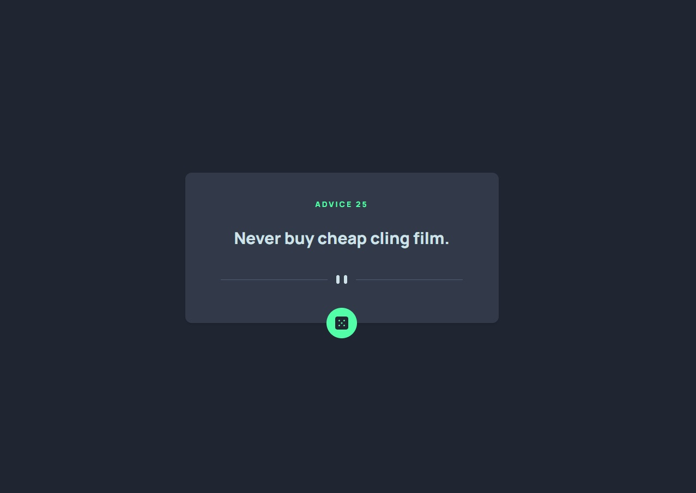

# Frontend Mentor - Advice generator app solution

This is a solution to the [Advice generator app challenge on Frontend Mentor](https://www.frontendmentor.io/challenges/advice-generator-app-QdUG-13db).

## Table of contents

- [Overview](#overview)
  - [The challenge](#the-challenge)
  - [Screenshot](#screenshot)
  - [Links](#links)
- [My process](#my-process)
  - [Built with](#built-with)
  - [What I learned](#what-i-learned)
  - [Useful resources](#useful-resources)
- [Author](#author)
- [Acknowledgments](#acknowledgments)

## Overview

### The challenge

Users should be able to:

- View the optimal layout for the app depending on their device's screen size
- See hover states for all interactive elements on the page
- Generate a new piece of advice by clicking the dice icon

### Screenshot



### Links

- Solution URL: [Solution URL](https://github.com/Grathienbeto/random-frase)
- Live Site URL: [Live site URL](https://grathienbeto.github.io/random-frase/)

## My process

### Built with

- CSS custom properties
- Mobile-first workflow
- Fetch Api
- [React](https://reactjs.org/) - JS library
- [Tailwind](https://tailwindcss.com/) - For styles

### What I learned

Code snippet on fetching with useEffect

```jsx
const [frase, setFrase] = useState({});
const [loading, setLoading] = useState(false);
const [error, setError] = useState();

const abortControllerRef = useRef(null);

const fetchFrase = async () => {
  // this will stop any data being replaced accidentically old data (for example, when pressing the dice button too quickly)
  abortControllerRef.current?.abort();
  abortControllerRef.current = new AbortController();

  setLoading(true);

  try {
    // will try to get the data from the server
    const response = await fetch(`${BASE_URL}`, {
      signal: abortControllerRef.current?.signal,
    });
    const data = await response.json();
    setFrase(data.slip);
  } catch (e) {
    // if the error is from a cancelled api request by the user, it will not show the error msj
    if (e.name === "AbortError") {
      console.log("Process aborted");
      return;
    }
    setError(e);
  } finally {
    setLoading(false);
  }
};

useEffect(() => {
  fetchFrase();
}, []);
```

If you want more help with writing markdown, we'd recommend checking out [The Markdown Guide](https://www.markdownguide.org/) to learn more.

### Useful resources

- This [video](https://www.youtube.com/watch?v=00lxm_doFYw&ab_channel=CosdenSolutions) is really good when learning how to fetch data from an API using React (useState, useEffect).

## Author

- Github - [Grathienbeto](https://github.com/Grathienbeto)
- Frontend Mentor - [@Grathienbeto](https://www.frontendmentor.io/profile/Grathienbeto)
- Twitter - [@betoluna89](https://twitter.com/betoluna89)

## Acknowledgments

I have to really thank [Cosden Solutions](https://www.youtube.com/@cosdensolutions) for this [video](https://www.youtube.com/watch?v=00lxm_doFYw&ab_channel=CosdenSolutions) on fetching data.
